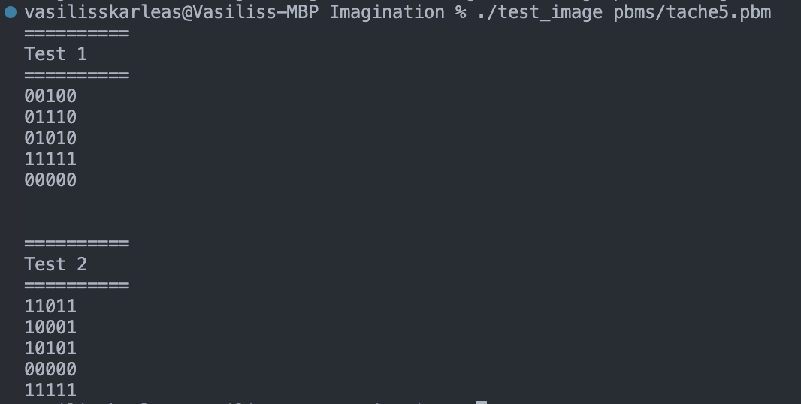
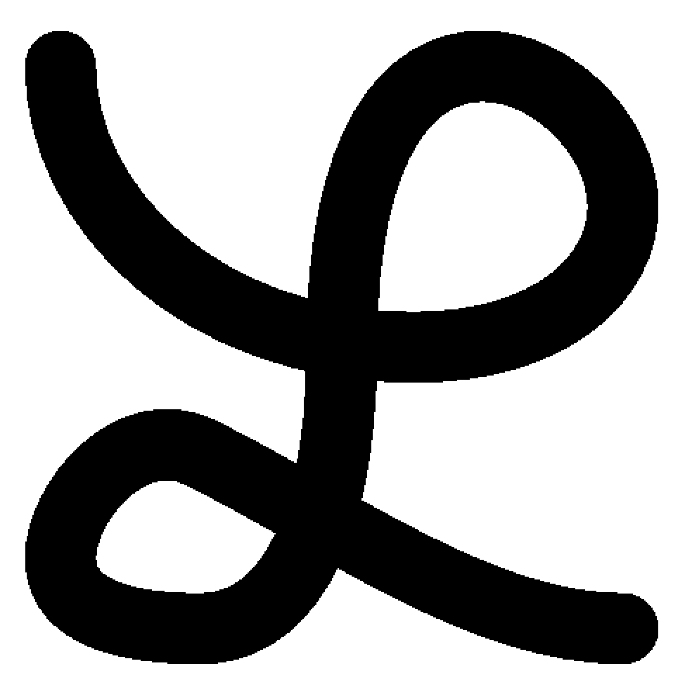
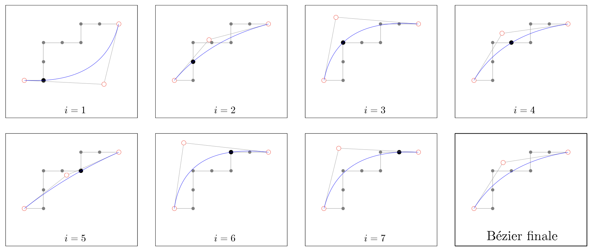
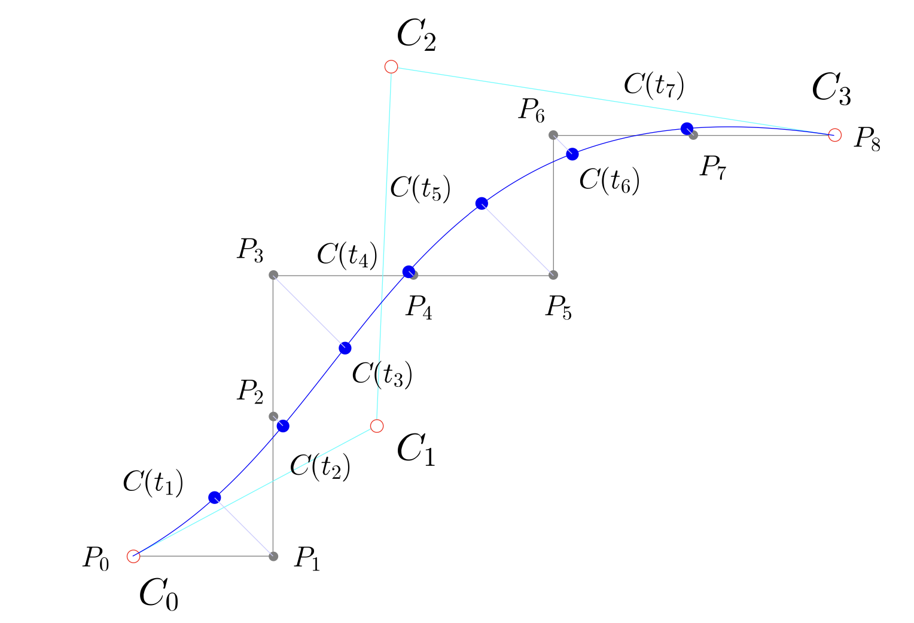

# Simplification des images prises avec une webcam

## Objectif

Le but principal de ce projet est de vectoriser et de simplifier des images obtenues via webcam en utilisant des méthodes dynamiques, incluant notamment la simplification par segments. Ce processus trouve des applications variées dans la vie réelle telles que :

* La détection de contours pour l'analyse d'images.
* La compression de données géométriques et la représentation de contours à différentes échelles, utiles en cartographie et dans les systèmes d'information géographique.
* etc...

Nous souhaitons apporter une dimension interactive à ce projet. À cette fin, nous proposons la capture d'images via une webcam. Ces images sont ensuite converties en niveaux de gris avant d’être simplifiées grâce à différentes techniques de vectorisation et de simplification (décrites plus en détail dans la section sur les méthodes de simplification).

## Inspiration

Notre projet, **ImagePulser**, s'inspire des avancées présentées lors de la conférence Google IO 2023, notamment en matière de détection d'objets dans les images. Les experts de Google ont détaillé une méthode selon laquelle les images sont d'abord filtrées et simplifiées en retirant les couleurs et les détails superflus, résultant en une image binaire composée uniquement de 0 et de 1, représentant respectivement le noir et le blanc. Cette simplification aide à préserver les informations essentielles tout en rendant les images plus accessibles pour l'analyse par un réseau neuronal, qui recherche ensuite des correspondances dans une base de données. Inspirés par cette technique de conservation d'information, nous avons développé **ImagePulser** pour exploiter ce principe de simplification et optimiser le traitement d'images.

## Interface Graphique

Notre projet, ImagePulser, bénéficie d'une interface graphique conviviale développée pour simplifier la navigation et l'utilisation par les utilisateurs. Cette interface permet une interaction fluide et directe avec les fonctionnalités du logiciel, enrichissant l'expérience utilisateur.

L'interface a été développée en utilisant la bibliothèque GTK. Voici les étapes clés de sa mise en œuvre :

1. **Initialisation des Widgets :** Configuration de différents widgets comme des étiquettes (labels), des zones de texte (entry), des boutons (buttons) et des espaces d'affichage d'image (image displays).
2. **Agencement des Widgets :** Organisation de ces éléments dans la fenêtre principale (pWindow) de manière ordonnée.
3. **Définition des Callbacks :** Attribution de fonctions de rappel aux boutons pour gérer les interactions utilisateur.
4. **Création de Fonctions Spécifiques :** Développement des fonctions décrivant les actions à exécuter pour chaque bouton, facilitant l'interconnexion entre les différentes parties du logiciel.

## Interconnexion des Programmes

Notre système est composé de plusieurs programmes principaux qui partagent une base de code commune tout en fonctionnant de manière indépendante. Certains demandent des arguments lors de leur exécution tandis que d'autres non. Nous exploitons la fonctionnalité de sous-processus sur l'ordinateur pour activer plusieurs sous-programmes alors qu’un programme principal est déjà en cours d'exécution. Ainsi, les callbacks de l'interface graphique peuvent déclencher des processus en arrière-plan selon les besoins.

> Plutôt que d'intégrer directement la logique de ces sous-programmes dans les fonctions de l'interface graphique, nous avons choisi de les maintenir séparés. Cette approche a significativement accéléré le développement en nous permettant de concentrer sur l'efficacité et la modularité du projet.

## Procédure

Pour atteindre les objectifs de notre projet, nous suivons les étapes ci-dessous :

1. **Capture d'image** : Utilisation d'une webcam pour capturer l'image désirée.
2. **Binarisation de l'image** : Conversion de l'image capturée en format binaire sans altérer l'image originale, ce qui permet de préparer l'image pour les étapes de simplification.
3. **Sauvegarde au format PBM** : L'image binaire est ensuite enregistrée au format PBM utilisant la propriété P4, plutôt que le format basique P1, afin de bénéficier d'une meilleure efficacité de stockage.
4. **Simplification de l'image** : Application de deux techniques de simplification différentes :

   1. **Simplification par segments** : Cette méthode décompose l'image en plusieurs segments linéaires, réduisant ainsi sa complexité tout en conservant les détails pertinents.
   2. **Simplification par courbes de Bézier** : Transformation de l'image en un ensemble de courbes de Bézier, et sauvegarde au format EPS (Adobe PostScript) pour une précision accrue et une manipulation aisée.

Ces étapes constituent notre protocole pour transformer des images brutes en représentations simplifiées et facilement manipulables, adaptées à diverses utilisations techniques.

## Spécifications de Simplification

Pour développer notre solution de simplification d'images, nous avons décomposé le problème en sept tâches distinctes. Chaque tâche aborde un aspect spécifique du processus de simplification et de vectorisation des images. Les tâches sont organisées comme suit :

1. **[Tâche 1 : Vectorisation d&#39;image bitmap (PBM)](md__2Users_2vasilisskarleas_2Library_2Mobile_01Documents_2com_0iapple_0iCloudDocs_2Documents_2Un7b9ad0e83b5fef2240f50c36899d100f.html)**
   Transformation d'images bitmap en un format vectoriel initial pour faciliter les manipulations géométriques ultérieures.
2. **[Tâche 2 : Intégration des fonctions de base de la géométrie en 2D](md__2Users_2vasilisskarleas_2Library_2Mobile_01Documents_2com_0iapple_0iCloudDocs_2Documents_2Un8ea8474aa6ed85fc9ee1e43275f989f7.html)**
   Développement et intégration d'un ensemble de fonctions essentielles pour le traitement géométrique des images, y compris les calculs de distance, les transformations de points, et autres opérations primaires en géométrie.
3. [Tâche 3 : Extraction d&#39;un contour d&#39;une image](md__2Users_2vasilisskarleas_2Library_2Mobile_01Documents_2com_0iapple_0iCloudDocs_2Documents_2Unb34d69c434e61114350b57d8b128efbe.html)
   Identification et extraction du premier contour visible dans une image, servant de base pour les simplifications subséquentes.
4. **[Tâche 4 : Sortie au format PostScript encapsulé](md__2Users_2vasilisskarleas_2Library_2Mobile_01Documents_2com_0iapple_0iCloudDocs_2Documents_2Un49afce17d9025abe9b61e4fc8befe8ab.html)**
   Génération de file_inputs au format EPS (Encapsulated PostScript) pour chaque image traitée, permettant une visualisation et une édition de haute qualité.
5. **[Tâche 5 : Extraction des contours multiples d’une image](md__2Users_2vasilisskarleas_2Library_2Mobile_01Documents_2com_0iapple_0iCloudDocs_2Documents_2Un77f2ca93f9576125fb5f6057429c35ee.html)**
   Répétition de l'extraction de contours sur une seule image pour obtenir plusieurs tracés, augmentant ainsi la profondeur de l'analyse visuelle.
6. **[Tâche 6 : Simplification de contour par segment](md__2Users_2vasilisskarleas_2Library_2Mobile_01Documents_2com_0iapple_0iCloudDocs_2Documents_2Una3b374ea236d85fc9a076b91fb278e66.html)**
   Application d'algorithmes de simplification pour réduire le nombre de points définissant un contour tout en conservant la forme générale de l'objet analysé.
7. **[Tâche 7 : Simplification par courbes de Bézier de degré 1 ou 2 (selon le choix de l&#39;utilisateur)](md__2Users_2vasilisskarleas_2Library_2Mobile_01Documents_2com_0iapple_0iCloudDocs_2Documents_2Un68b49c6466e6acb98108c9ced4eb80bc.html)**
   Transformation des contours en courbes de Bézier, offrant un contrôle précis sur le degré de simplification et la fluidité des lignes.

## Problèmes Rencontrés et Solutions Apportées

### 1. Adaptation de la Résolution de la Webcam

**Problème :** La webcam de notre ordinateur était de très haute qualité (beaucoup de pixels), ce qui a entraîné des difficultés lors de la manipulation des images capturées en raison de leur grande taille.

**Solution :** Nous avons réduit la résolution à 1080 pixels pour faciliter le traitement des images. Lors de l'implémentation du code sur un autre ordinateur équipé d'une webcam de moindre qualité, nous avons rencontré des erreurs de type "Call Dumped" dues à des ouvertures et fermetures répétitives de la caméra. Pour résoudre ce problème, nous avons encore diminué la résolution à 640 pixels, ce qui a permis une compatibilité avec la webcam du robot utilisé dans notre projet.

### 2. Gestion de l'Asynchronisme dans les Interactions UI

**Problème :** Les interactions avec l'interface graphique nécessitaient une communication efficace entre différentes tâches sans bloquer l'interface utilisateur.

**Solution :** Nous avons opté pour la création de différents exécutables, permettant de gérer des processus asynchrones. Cette approche a assuré une fluidité dans les interactions avec l'interface graphique, améliorant l'expérience utilisateur.

### 3. Compilation sur Différentes Configurations

**Problème :** Compiler le même programme sur différents ordinateurs était un défi en raison des diverses versions de compilateurs disponibles.

**Solution :** Nous avons découvert que l'option `-std=c++17` permettait de standardiser le processus de compilation en spécifiant la version du compilateur C++ à utiliser. De plus, l'intégration de file_inputs C dans notre code C++ posait problème.

**Solution Complémentaire :** Un Makefile a été créé pour compiler correctement les file_inputs avec gcc pour le C et g++ pour le C++, garantissant ainsi que les bonnes pratiques de compilation soient respectées pour chaque type de file_input.

### 4. Gestion des Formats de file_inputs Images

**Problème :** La transformation des images capturées en format PBM était complexe, surtout pour des images de haute résolution qui exigeaient une gestion optimale de la mémoire.

**Solution :** Initialement, nous utilisions le codec P1 pour les images PBM, qui s'est avéré inadéquat pour des images de haute qualité. Après quelques tests, nous avons opté pour le codec P4, qui s'est révélé beaucoup plus efficace pour gérer des images à haute résolution sans surcharger la mémoire.

### 5. PostScript pourrait accepter au moins 4 points pour la declaration des courbes

**Problème :** Les courbes de bezier de degré 2 sont parametrés de 3 points de control. D'autre côtè, PostScript syntax attendait au moins 4 points pour une courbe qui n'etait pas le cas pour les courbes de bezier de degré 4.

**Solution :** On a fait une recherche, et on adecouverte que c'est possible de convertir une courbe de bezier de degré 2 vers une courbe de bezier de degré 3. C'est bien la fonction `conversion_bezier2_to_bezier3`

## Tests

Voici quelques tests qu'on a effectué pendant le development du projet.

### test_image.c

Ce test permet de vérifier si la fonction de visualisation d'une image PBM sur le terminal fonctionne correctement, ainsi que de voir si la création d'une image négative de l'image originale est correcte. Pour l'appeler, on utilise la commande suivante :

```bash
./test_image pbms/tache5.pbm
```



### apply_geometry.c

Vérification des fonctions de géométrie 2D. Appel :

```bash
./apply_geometry
```

Voici les resultats:

```bash
Test des fonctions de géométrie dans le plan à deux dimensions
Points utilisés dans ce test :
A : (1.000000, -3.000000)
B : (4.000000, 1.000000)
==========
Test de l'addition de points
5.000000 -2.000000 


----------
Vecteurs utilisés dans ce test :
Vecteur V : (1.000000 -> 2.000000)
Vecteur I : (0.000000 -> 5.000000)
==========
Test de l'addition de vecteurs
1.000000 7.000000 

Test de la multiplication d'un vecteur par un scalaire
3.000000 6.000000 

Test de la multiplication d'un point par un scalaire
3.000000 -9.000000 

Test du produit scalaire
10.000000 

Test de la norme d'un vecteur
5.000000 

Test de la distance entre deux points
5.000000 

Test de la distance point-segment pour la Tâche 6
Points utilisés dans ce test :
A : (0.000000, 6.000000)
B : (0.000000, 6.000000)
==========
0.000000 distance point-segment
```

On peut remarquer qu'effectivement le calcul est correct.

### test_postscript.c

Vérification de la création des fichiers PostScript valides suivant deux méthodes de remplissage : "stroke" et "fill". Voici les résultats :

| PBM Originale                                  | EPS Stroke                                     |
| ---------------------------------------------- | ---------------------------------------------- |
|  |  |

### test_approx.c

Vérification de l'approximation d'un segment par une courbe de Bézier de degré 2. Étant donné les points d'un segment :

| i  | 0     | 1     | 2     | 3     | 4     | 5     | 6     | 7     | 8     |
| -- | ----- | ----- | ----- | ----- | ----- | ----- | ----- | ----- | ----- |
| Pi | (0,0) | (1,0) | (1,1) | (1,2) | (2,2) | (3,2) | (3,3) | (4,3) | (5,3) |

Le traitement en logiciel Mathematica est le suivant :



Et les resultats obtenus sont:

| i | Ci,1               | ωi              |
| - | ------------------ | ---------------- |
| 1 | (7080, −360)/1680 | 14/64 = 0.21875 |
| 2 | (3080, 3639)/1680  | 24/64 = 0.375   |
| 3 | (1064, 5656)/1680  | 30/64 = 0.46875 |
| 4 | (2520, 4200)/1680  | 32/64 = 0.5     |
| 5 | (3752, 2968)/1680  | 30/64 = 0.46875 |
| 6 | (840, 5880)/1680   | 24/64 = 0.375   |
| 7 | (1320, 5400)/1680  | 14/64 = 0.21875 |

Donc, le point de controle C1 obtenu est = (2600, 4120)/1680 ≃ (1.547619, 2.452381)

### test_approx3.c

Ce test réalise la même chose que test_approx.c sauf qu'il est pour les courbes de Bézier de degré 3. Pour le même exemple on a:

| i  | 0     | 1     | 2     | 3     | 4     | 5     | 6     | 7     | 8     |
| -- | ----- | ----- | ----- | ----- | ----- | ----- | ----- | ----- | ----- |
| Pi | (0,0) | (1,0) | (1,1) | (1,2) | (2,2) | (3,2) | (3,3) | (4,3) | (5,3) |

Le traitement en logiciel Mathematica est le suivant :



et le programme fournit les données suivantes:

| Indice i     | 1     | 2     | 3     | 4     | 5     | 6     | 7     |
| ------------ | ----- | ----- | ----- | ----- | ----- | ----- | ----- |
| d(Pi, Ci(t)) | 0.588 | 0.100 | 0.726 | 0.045 | 0.722 | 0.186 | 0.070 |

> À noter que Ci(t) est le calcul du point courant pour l'indice i de l'algorithme.

Le point P3 est le point le plus  éloigné de la courbe de Bézier, et dmax ≃ 0, 726.

## Pour aller plus loin...

Comme dans tout projet, nous avons rencontré des défis techniques en cours de route. Cependant, ces obstacles nous ont également ouvert de nouvelles perspectives pour l'avenir de notre projet. Voici quelques pistes pour aller plus loin :

- **Développer un réseau de neurones** : Créer un réseau de neurones capable de détecter des objets de manière similaire à celle présentée par les développeurs de Google IO 2023 pour l'application Google Photos, en utilisant nos propres techniques de simplification.
- **Améliorer la complexité algorithmique** : Travailler sur l'optimisation de nos algorithmes pour permettre la simplification et la vectorisation d'images de très grande taille de manière plus efficace.
- **Intégration et automatisation** : Explorer des moyens d'intégrer ces techniques dans des systèmes automatisés, comme des robots ou des drones, pour des applications en temps réel.
- Detecter un erreur qui ne permet pas aux certaines images d'être simplifiés

Ces développements futurs nous permettraient d'améliorer la performance et l'applicabilité de notre projet de recherche , ouvrant ainsi la voie à des innovations encore plus significatives dans le domaine de la simplification et de la vectorisation des images.

## Rapports personnels

1. [Yanis Sadoun](md__2Users_2vasilisskarleas_2Library_2Mobile_01Documents_2com_0iapple_0iCloudDocs_2Documents_2Unc910271b7433a6b7d6b8408396287478.html)
2. [Evanthia Virginia Anastasopoulou](md__2Users_2vasilisskarleas_2Library_2Mobile_01Documents_2com_0iapple_0iCloudDocs_2Documents_2Un70179f5e4467f655c1d7a1f343246bec.html)
3. [Vasileios Filippos Skarleas](md__2Users_2vasilisskarleas_2Library_2Mobile_01Documents_2com_0iapple_0iCloudDocs_2Documents_2Un0c0414fab66fc0670d50fc7cc0f86f00.html)
