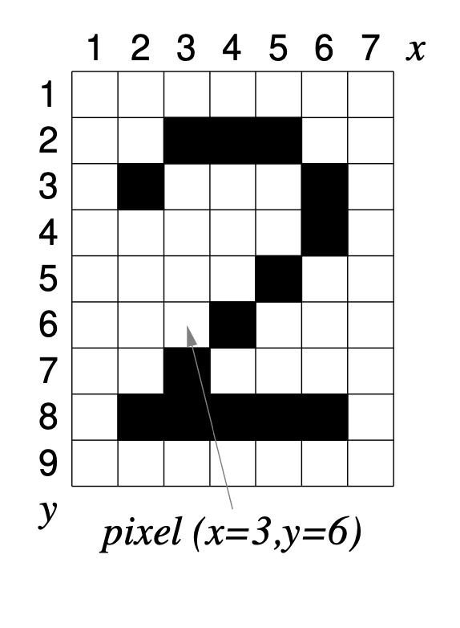

# Tâche 1 : Vectorisation d'image bitmap (PBM)

## Structures de données

Dans ce projet, nous utilisons principalement un objet nommé `Image`. La définition de cet objet varie en fonction du langage de programmation utilisé, certaines bibliothèques étant plus adaptées à C++ qu'à C, comme OpenCV. Pour les programmes écrits en C++, cet objet est défini via la classe `Mat` de la bibliothèque OpenCV. Pour ceux écrits en C, nous avons défini la structure nous-mêmes comme suit :

```c
typedef struct Image_ {
    UINT the_height_of_the_image; // Hauteur de l'image
    Pixel* pointer_to_pixel_array; // Pointeur vers le tableau de pixels
} Image;
```

Cette structure est basée sur un type énuméré associé à la propriété `Pixel`. Voici sa déclaration :

```c
typedef enum {BLANC=0, NOIR=1} Pixel;
```

## Gestion des file_inputs images

La manipulation de file_inputs images dans des formats tels que JPEG, JPG, PNG, WEBP, SVG, etc., peut être complexe. Pour simplifier notre approche, nous avons choisi d'utiliser le format PBM, un format de bitmap monochrome simple et universel.

## Bitmap (PBM)

Un bitmap monochrome (PBM) est une grille rectangulaire de pixels noirs ou blancs. Chaque pixel est défini par un couple de coordonnées (x, y) où x varie de 1 à L (de gauche à droite) et y de 1 à H (de haut en bas). L représente la largeur de l'image et H sa hauteur.

Dans notre système, tout pixel situé à l'extérieur des dimensions définies de l'image est considéré comme blanc. Par exemple, pour une image de dimensions 7 x 9, les positions (0,3) ou (4, 10) correspondraient à des pixels blancs en dehors de l'image.


