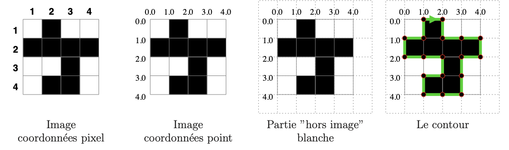
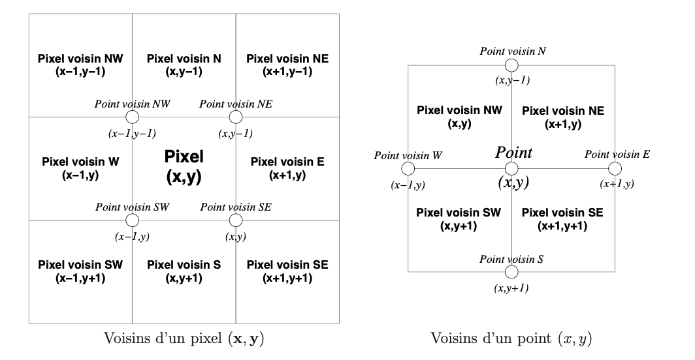

# Tâche 3 : Extraction d'un contour d'une image

## 3.1 - Un contour c'est quoi ?

Un **contour** dans une image en Noir & Blanc est défini comme la démarcation qui sépare les zones de pixels noirs des zones de pixels blancs. Pour les images traitées dans ce projet, tout ce qui se trouve à l'extérieur de l'image est considéré comme blanc. L'extraction de contour consiste donc à identifier et à suivre le bord qui marque la transition entre les zones noires et blanches, y compris celles adjacentes à l'espace "hors image".

Le processus d'extraction génère un polygone formé par une série de points qui décrivent ce contour. Ces points sont reliés par des segments qui tracent précisément le chemin du contour.

## Exemple d'extraction de contour

L'image suivante illustre un exemple de grille d'image et la représentation correspondante des contours extraits :



Dans cet exemple, en partant du point (1.0, 0.0), le contour identifié est un polygone composé de 19 points (formant 18 segments). Ceux-ci décrivent le contour complet autour des blocs noirs comme suit :

- (1.0, 0.0) → (2.0, 0.0) → (2.0, 1.0) → (3.0, 1.0) → (4.0, 1.0)
- (4.0, 2.0) → (3.0, 2.0) → (3.0, 3.0) → (3.0, 4.0) → (2.0, 4.0)
- (1.0, 4.0) → (1.0, 3.0) → (2.0, 3.0) → (2.0, 2.0) → (1.0, 2.0)
- (0.0, 2.0) → (0.0, 1.0) → (1.0, 1.0) → (1.0, 0.0)

Cette série de points et de segments crée une frontière précise qui encapsule les zones noires, essentielle pour des analyses plus avancées comme la vectorisation ou d'autres formes de traitement d'image.

## 3.2 - Détermination du Contour

### Fonctionnement de l'Algorithme

La tâche de détermination du contour dans une image en Noir & Blanc utilise un automate, que nous appellerons "robot", pour suivre le contour polygonal qui sépare les pixels noirs de l'image des pixels blancs. Le robot se déplace de manière à garder un pixel noir à sa droite et un pixel blanc à sa gauche, poursuivant ainsi son chemin jusqu'à ce qu'il revienne à son point de départ et retrouve son orientation initiale.

### Définition des Orientations

Le robot peut se déplacer dans quatre directions cardinales, qui correspondent aux orientations suivantes :

```c
typedef enum {Nord, Est, Sud, Ouest} Orientation;
```

Cette énumération en C permet de définir clairement les orientations possibles pour le robot lorsqu'il navigue le long du contour de l'image.

### Algorithme de Suivi du Contour

L'algorithme pour suivre le contour est décrit étape par étape ci-dessous :

1. **Trouver le Pixel de Départ** :

   - Identifier un pixel de départ \((x, y)\) qui est sur le bord du contour entre les pixels noirs et blancs.
2. **Initialiser les Paramètres** :

   - Définir la position initiale à \((x_0, y_0) = (x - 1, y - 1)\).
   - Initialiser l'orientation à Est.
3. **Exécuter la Boucle de Suivi** :

   - Commencer une boucle pour suivre le contour.
   - À chaque itération de la boucle :
     - **Mémoriser la Position** : Enregistrer la position actuelle pour tracer le contour.
     - **Avancer** : Déplacer le robot d'une unité dans la direction actuelle.
     - **Calculer la Nouvelle Orientation** : Ajuster l'orientation basée sur les pixels adjacents pour maintenir le pixel noir à droite et le blanc à gauche.
     - **Vérifier la Condition de Fin** : Si le robot revient à la position initiale \((x_0, y_0)\) avec l'orientation Est, terminer la boucle.
4. **Fin de la Boucle** :

   - Le robot termine son parcours lorsque la condition de fin est satisfaite, signifiant que le contour complet a été suivi.

```c
// Initialisation
(x, y) ← trouver_pixel_depart(I); // Trouver un pixel de départ sur le contour
(x0, y0) ← (x − 1, y − 1);       // Définir la position initiale
orientation ← EST;               // Définir l'orientation initiale à Est
boucle ← VRAI;                   // Initialiser la boucle de suivi

// Exécuter la boucle de suivi du contour
while (boucle) {
    memoriser_position();        // Mémoriser la position actuelle du robot
    avancer();                   // Faire avancer le robot d'une unité
    nouvelle_orientation();      // Calculer la nouvelle orientation basée sur les pixels adjacents

    // Vérifier si le robot est revenu à sa position et orientation initiales
    if (position == (x0, y0) && orientation == EST) {
        boucle ← FAUX;           // Arrêter la boucle si le robot est revenu à son point de départ
    }
}

// Mémoriser la dernière position après la fin de la boucle
memoriser_position();            // Enregistrer la position finale pour compléter le tracé du contour
```



## 3.3 - Contour sous forme d’une séquence

Le contour calculé doit être stocké sous forme d’une séquence de points. Cependant, la taille de cette séquence n’est pas connue à l’avance, ce qui implique des considérations spécifiques pour son stockage.

#### Solutions pour le stockage d'un contour

**A - Stockage sous forme de file_input**
Les points du contour peuvent être stockés progressivement dans un file_input. Cependant, cette méthode présente un inconvénient majeur : l'accès aux file_inputs est généralement beaucoup plus lent que l'accès à la mémoire vive.

**B - Stockage en mémoire**

**B-1) Structure de taille fixe de type tableau**
Une option est d'utiliser une structure de taille fixe pour stocker les points du contour. Cette structure est définie comme suit :

```c
#define DIMMAX ...

typedef struct Point {
    double x, y;
} Point;

typedef struct Contour {
    unsigned int np;          // Nombre de points de la séquence
    Point tab[DIMMAX];        // Tableau pour stocker les points
} Contour;
```

**Inconvénients :**

- Si `DIMMAX` est trop grand, il peut être difficile de calculer plusieurs contours ou même un seul, en raison de la saturation de la mémoire.
- Si `DIMMAX` est trop petit, il sera impossible de stocker certains contours plus grands.

**B-2) Structure adaptable à la taille du contour**
Une meilleure solution peut être d'utiliser une structure permettant d’adapter la taille de la mémoire en fonction du contour. Le contour est ainsi "construit" progressivement, à partir d'une séquence vide, en ajoutant au fur et à mesure les points à la fin de la séquence.

**Structures recommandées :** Les listes chaînées sont idéales pour ces opérations, car elles permettent :

- D'initialiser avec une séquence vide.
- D'ajouter un élément supplémentaire à la fin d’une séquence.
- De maintenir une séquence ordonnée.
- D'effacer une séquence (la vider).

Pour les tâches d'extraction de contour (tâches 3 et 5), les listes chaînées sont suffisantes. Cependant, pour les tâches de simplification de contour (tâches 6 et 7), une structure de données de type tableau est nécessaire pour pouvoir accéder à un élément d’un contour à l’aide d’un indice. En outre, l'opération de concaténation de deux listes chaînées peut être utile pour ces tâches.

#### Nos Solutions pour le stockage d'un contour

```c
#include<stdio.h>  /* Fonctions d'entrée/sortie standard de C */
#include<stdlib.h> /* Fonctions de gestion de mémoire dynamique */

#include "geometry.h"
#include "sequence_point.h"

/* Crée une nouvelle cellule de liste avec le point 'v'
   Retourne un pointeur vers la nouvelle cellule de liste créée
   Le programme se termine si l'allocation de mémoire échoue */
Cellule_Liste_Point *creer_element_liste_Point(Point v) {
    Cellule_Liste_Point *el = (Cellule_Liste_Point *)malloc(sizeof(Cellule_Liste_Point));
    if (el == NULL) {
        fprintf(stderr, "Échec de l'allocation mémoire pour la création d'un nouvel élément de point\n");
        exit(-40);
    }
    el->data = v;
    el->suiv = NULL;
    return el;
}

/* Crée une nouvelle cellule de liste pour la liste des contours */
Cellule_Liste_Contours *creer_element_liste_Contours(Liste_Point v) {
    Cellule_Liste_Contours *el = (Cellule_Liste_Contours *)malloc(sizeof(Cellule_Liste_Contours));
    if (el == NULL) {
        fprintf(stderr, "Échec de l'allocation mémoire pour la création d'un nouvel élément de contour\n");
        exit(-50);
    }
    el->data = v;
    el->suiv = NULL;
    return el;
}

/* Crée une liste de points vide */
Liste_Point creer_liste_Point_vide() {
    return (Liste_Point) {0, NULL, NULL};
}

/* Crée une liste de contours vide */
Liste_Contours creer_liste_Contours_vide() {
    return (Liste_Contours) {0, NULL, NULL};
}

/* Ajoute l'élément 'e' à la fin de la liste 'L', retourne la liste modifiée */
void ajouter_element_liste_Point(Liste_Point *L, Point e) {
    Cellule_Liste_Point *el = creer_element_liste_Point(e);
    if (L->taille == 0) { // Premier élément de la liste
        L->first = L->last = el;
    } else {
        L->last->suiv = el;
        L->last = el;
    }
    L->taille++;
}

/* Ajoute un élément de contour à une liste de contours */
void ajouter_element_liste_Contours(Liste_Contours *L, Liste_Point e) {
    Cellule_Liste_Contours *el = creer_element_liste_Contours(e);
    if (L->taille == 0) { // Premier élément de la liste de contours
        L->first = L->last = el;
    } else {
        L->last->suiv = el;
        L->last = el;
    }
    L->taille++;
}

/* Supprime tous les éléments de la liste, retourne une liste vide */
Liste_Point supprimer_liste_Point(Liste_Point L) {
    Cellule_Liste_Point *el = L.first;
    while (el) {
        Cellule_Liste_Point *suiv = el->suiv;
        free(el);
        el = suiv;
    }
    L.first = L.last = NULL;
    L.taille = 0;
    return L;
}

/* Concatène la liste 'L2' à la fin de la liste 'L1', retourne la liste modifiée */
Liste_Point concatener_liste_Point(Liste_Point L1, Liste_Point L2) {
    if (L1.taille == 0) return L2; // Si L1 est vide
    if (L2.taille == 0) return L1; // Si L2 est vide
    L1.last->suiv = L2.first; // Lie le dernier élément de L1 au premier de L2
    L1.last = L2.last;        // Met à jour le dernier élément de L1 pour qu'il soit celui de L2
    L1.taille += L2.taille;   // Met à jour la taille de L1
    return L1;
}

/* Convertit une liste de points en un tableau de points */
Tableau_Point sequence_points_liste_vers_tableau(Liste_Point L) {
    Tableau_Point T;
    T.taille = L.taille;
    T.tab = malloc(sizeof(Point) * T.taille);
    if (T.tab == NULL) {
        fprintf(stderr, "Éch

ec de l'allocation mémoire pour la conversion de la liste en tableau\n");
        exit(-60);
    }
    for (int k = 0, Cellule_Liste_Point *el = L.first; el != NULL; el = el->suiv, k++) {
        T.tab[k] = el->data; // Remplir le tableau avec les données de la liste
    }
    return T;
}

/* Affiche le contour */
void ecrire_contour(Liste_Point L) {
    Tableau_Point TP = sequence_points_liste_vers_tableau(L);
    printf("%d segments\n", TP.taille - 1);
    printf("%d points: [", TP.taille);
    for (int k = 0; k < TP.taille; k++) {
        printf("(%5.1f,%5.1f)", TP.tab[k].x, TP.tab[k].y);
    }
    printf("]\n");
    free(TP.tab); // Libère le tableau après utilisation
}
```

## Pourquoi Convertir une Liste en Tableau?

Dans le contexte de notre projet, où les contours des objets sont fréquemment accédés et manipulés pour diverses analyses et transformations, utiliser un tableau offre une efficacité nettement supérieure. Une fois que les contours sont stockés dans un tableau, il est beaucoup plus efficace de rechercher, d'accéder, et de modifier les points selon les besoins, comparativement à une structure dynamique comme une liste chaînée où chaque accès nécessite de traverser les liens de la liste depuis le début jusqu'à l'élément ciblé.
