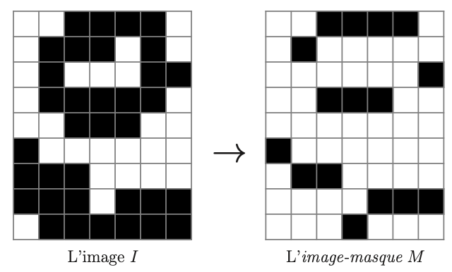
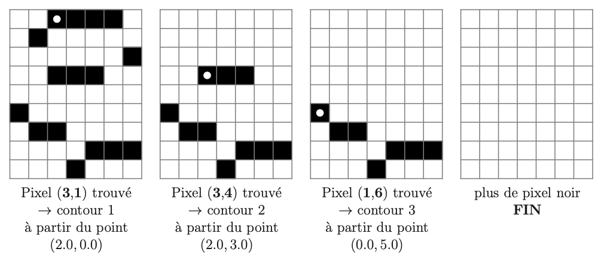

# Tâche 5 - Extraction des Contours d’une Image

## Contexte

Dans la **Tâche 3**, nous avons abordé l'extraction d'un seul contour dans une image. Cependant, les images plus complexes peuvent présenter plusieurs contours, qui peuvent être disjoints ou imbriqués. Cette tâche vise à détecter tous ces contours.

## Méthode

**Principe :** Chaque contour fermé passe nécessairement par un point (x, y) dont le pixel voisin au nord-est (NE) est blanc et le pixel voisin au sud-est (SE) est noir. Inversement, tout pixel noir (x, y) avec un voisin au nord (N) blanc est adjacent à un contour qui passe par les points voisins nord-ouest (NW, x-1, y-1) et nord-est (NE, x, y-1).

**Processus de détection :**

- **Étape 1 : Identification initiale des pixels de contour**

  - Créer une image auxiliaire \( M \), appelée image-masque, ayant les mêmes dimensions que l'image originale \( I \).
    
  - Chaque pixel (x, y) de \( M \) est coloré en noir si et seulement si le pixel correspondant dans \( I \) est noir et que son voisin direct au nord (N) est blanc.
- **Étape 2 : Recherche et marquage des contours**

  - Tant qu'il existe un pixel noir dans \( M \), rechercher un nouveau contour à partir du point voisin nord-ouest (NW, x - 1, y - 1) en commençant à se déplacer vers l'est (E) -> `trouver_pixel_de_depart`.
  - Lors du parcours d’un contour, lorsque le "robot" se déplace vers l'est à partir d'un point (x, y), le pixel voisin sud-est (SE, x, y) dans \( M \) est converti en blanc pour éviter les revisites et marquer la progression du contour.

## Objectif de la méthode

Cette méthode permet d'isoler et de suivre chaque contour dans une image complexe en utilisant une approche systématique qui commence par identifier les bords potentiels, puis en suivant ces bords tout en marquant leur progression pour éviter les répétitions et assurer l'exhaustivité de la détection.

## Visualisation

Les contours détectés peuvent être visualisés en superposant l'image-masque \( M \) sur l'image originale \( I \), ou en les affichant séparément pour analyser les résultats. Cela est essentiel pour des applications nécessitant une précision dans la segmentation des images, telles que dans le traitement médical d'images, la reconnaissance de formes ou les applications de vision par ordinateur.

Après avoir établi les fondations nécessaires pour l'identification et l'extraction des contours dans des images, nous abordons maintenant la phase de simplification. Cette étape est cruciale pour réduire la complexité des données tout en préservant les aspects essentiels des formes détectées, facilitant ainsi leur manipulation et leur analyse ultérieures.

Nous avons développé deux méthodes de simplification spécifiques pour notre projet :

1. Simplification par segments (tâche 6)
2. Simplification par courbes de Bezier (tâche 7)
