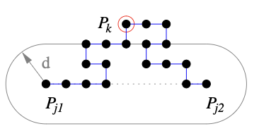

# Tâche 6 : Simplification de Contour par Segment

## 6.1 - Présentation

La vectorisation d'images produit un ou plusieurs contours, chacun formé d'une séquence de points. Ces contours peuvent être ensuite simplifiés pour réduire leur complexité tout en conservant les caractéristiques essentielles de l'image. Cette simplification est basée sur un critère géométrique simple et utilise une distance-seuil pour mesurer l'écart admissible entre la séquence initiale et la séquence simplifiée.

## Principe de la Simplification par une Distance-Seuil

### Approche pour un Contour Polygonal

Pour un contour polygonal C constitué des points {P_j1, ..., P_j2} avec j1 < j2, l'approche consiste à examiner la zone située à une distance inférieure ou égale à une distance-seuil d du segment S formé par [P_j1, P_j2]. On identifie alors le point P_k qui est le plus éloigné de ce segment. Cette méthode repose sur le calcul de la distance entre un point et un segment.



> Distance seuil: c'est la distance autour du segment en question

## 6.3 - Algorithme de Douglas-Peucker

L'algorithme de Douglas-Peucker est une méthode récursive de simplification de contours basée sur un critère de distance. Voici les étapes clés de l'algorithme :

1. **Initialisation** : Déterminer le segment initial qui joint les deux extrémités du contour (ou de la partie du contour à simplifier).
2. **Recherche du point le plus éloigné** : Trouver le point du contour qui est le plus éloigné du segment initial, et calculer cette distance maximale.
3. **Décision de simplification** :
   - **Si la distance maximale est inférieure à la distance-seuil** : Le segment est considéré comme une représentation adéquate de cette partie du contour.
   - **Si la distance maximale est supérieure à la distance-seuil** : Le contour est divisé en deux au point le plus éloigné, et l'algorithme est appliqué récursivement à chaque moitié.
4. **Concaténation** : Les segments obtenus des récursions sont ensuite concaténés pour former le contour simplifié final.

Ce processus permet de réduire considérablement le nombre de points d'un contour tout en conservant sa forme générale, ce qui est essentiel pour les applications nécessitant une représentation simplifiée mais précise des formes.

> Dans le cas de distance maximale supérieure à la distance-seuil, l'agorithme utilise une approche diviser pour régner.

```c
Contour simplification_douglas_peucker(Tableau_Point T, int j1, int j2, double d)
{
    // Création du segment
    Segment S;
    S.A = T.tab[j1];
    S.B = T.tab[j2];

    // Initialisation des variables
    double distance;
    double max_distance = 0;
    int far_away;

    // Algorithme de Douglas Peucker
    for (int i = j1 + 1; i < j2; i++)
    {
        distance = distance_point_segment(T.tab[i], S);
        if (max_distance < distance) // objectif : trouver le point le plus eloigné du segment en question qui est [j1,j2]
        {
            max_distance = distance;
            far_away = i;
        }
    }

    // Condition d'arrêt selon le seuil declaré
    if (max_distance <= d)
    {
        Contour L;
        L = creer_liste_Point_vide();
        ajouter_element_liste_Point(&L, S.A);
        ajouter_element_liste_Point(&L, S.B);
        return L;
    }
    else
    {
        // Récursivité [méthode diviser pour régner]
        Contour L1;
        L1 = creer_liste_Point_vide();
        L1 = simplification_douglas_peucker(T, j1, far_away, d);

        Contour L2;
        L2 = creer_liste_Point_vide();
        L2 = simplification_douglas_peucker(T, far_away, j2, d);

        return concatener_liste_Point(L1, L2);
    }
}
```
