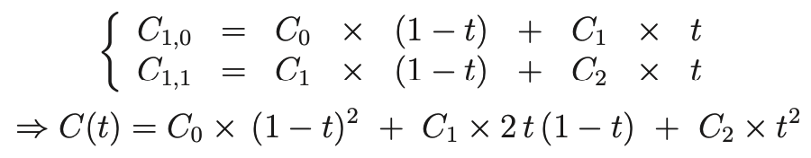
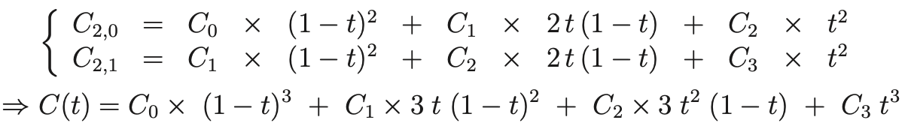
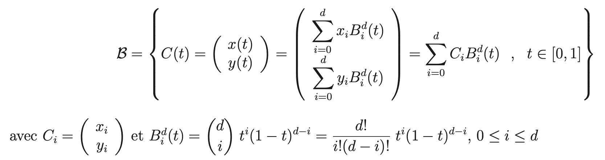
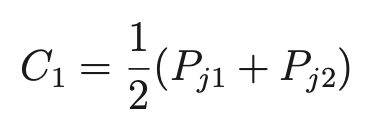
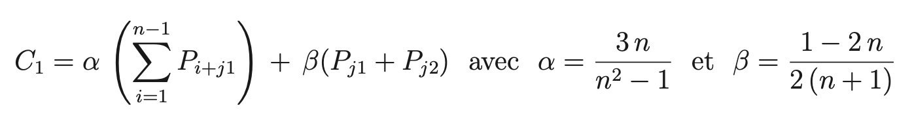

# Tâche 7 : Simplification par Courbes de Bézier de Degré 1 ou 2

## Introduction aux Courbes de Bézier

Les courbes de Bézier sont des outils essentiels en infographie pour modéliser des formes lisses et continues. Elles sont définies par des polynômes paramétriques, où chaque courbe est contrôlée par plusieurs points appelés points de contrôle. Ces points influencent la forme de la courbe mais ne sont pas nécessairement traversés par celle-ci, sauf pour les points aux extrémités.

## Courbes de Bézier de Degré 1 et 2

### Definitions

- **Courbes de Bézier de degré 1 :**

  - Ce sont essentiellement des lignes droites entre deux points de contrôle C0 et  C1 .
  - La formule pour une courbe de Bézier de degré 1 est donnée par C(t) = (1 - t)C0 + tC1 pour t  dans [0, 1].
  - Dans le contexte de simplification, utiliser une courbe de Bézier de degré 1 revient à remplacer une séquence de points par un simple segment de droite, réduisant ainsi la complexité sans perdre les informations critiques.
- **Courbes de Bézier de degré 2 (quadratiques) :**

  - Ces courbes introduisent un point de contrôle supplémentaire  C2 , permettant la formation d'arcs de parabole.
  - La formule est C(t) = (1 - t)^2C0 + 2t(1 - t)C1 + t^2 C2 .
  - Le second degré offre une plus grande flexibilité pour modéliser les courbures, permettant de mieux approximer des formes complexes avec moins de points que la linéarisation simple.
- **Courbes de Bézier de degré 3 (Bézier Cubique)**

  - Une courbe de Bézier cubique présente (au plus) un point d’inflexion.
  - La formule est C(t)=(1−t)^3 * C0 + 3t(1−t)^2 * C1+3t 2(1−t)C2+t^3 * C3

## Courbes de Bézier de degré 2 et 3

Notre projet se concentre sur l'utilisation des courbes de Bézier de degré 2 et de degré 3. Les courbes de Bézier sont des courbes paramétriques polynomiales définies par un ensemble de points de contrôle. Voici comment ces courbes sont calculées pour chaque degré :

- **Cas de degré 2 (d=2)** : La courbe C est définie par trois points de contrôle C0, C1, et C2. La représentation de cette courbe est illustrée ci-dessous :
  
- **Cas de degré 3 (d=3)** : La courbe C est définie par quatre points de contrôle C0, C1, C2, et C3. La représentation de cette courbe est illustrée ci-dessous :
  

> c(t) est le point courant sur une courbe de Bézier qu;on utilisera ci-dessous pour la calcul de la distance entre un point et une courbe de Bézier. Voir paragraphe "Méthode de Calcul de la distance entre un point et une courbe de Bézier de Degré 2"

Les courbes de Bézier sont exprimées à l'aide de la base de Bernstein plutôt que la base des monômes traditionnelle {1, t, t2, . . . , td} . Ci-dessous, vous trouverez une illustration montrant comment les points de contrôle sont calculés selon cette base :



## Utilisation des Courbes de Bézier dans le Projet

Dans notre projet, nous utilisons les courbes de Bézier pour simplifier les contours en réduisant le nombre de points nécessaires tout en préservant une approximation fidèle de la forme originale. Le degré de la courbe de Bézier choisi (degré 2 ou degré 3) est déterminé par la complexité de la forme à modéliser et la précision exigée pour l'application finale.

- **Degré 2** : Ce degré est choisi pour traiter les contours qui sont relativement droits ou présentent de légères courbes. Dans ce cas, la priorité est donnée à la simplicité plutôt qu'à une précision absolue de la courbe.
- **Degré 3** : Ce degré est utilisé pour les formes plus complexes nécessitant une modélisation précise des virages et des boucles. Le degré 3 permet de capturer ces détails sans nécessiter l'ajout de nombreux points supplémentaires, optimisant ainsi le rendu et la performance.

## Simplification par courbe de Bézier de Degré 2

L'adaptation de l'algorithme de Douglas-Peucker pour la simplification par courbes de Bézier de degré 2 présente plusieurs différences clés :

1. **Remplacement des Segments par des Courbes de Bézier** :
   Au lieu de simplifier les contours en utilisant des séquences de segments droits, notre méthode emploie des séquences de courbes de Bézier de degré 2.
2. **Approximation des Contours Initiaux** :
   Pour un contour initial CONT = P_{j1}, ..., P_{j2}\}\), au lieu de l'approximer par un simple segment S = [P_{j1}, P_{j2}], nous utilisons une courbe de Bézier B = [C0, C1, C2] où C0 = P_{j1} et C2 = P_{j2}. Cette approximation est réalisée par la fonction `bezier2_approximation`.
3. **Calcul de la Distance** :
   Au lieu de mesurer la distance entre un point et un segment, nous utilisons la fonction `distance_point_bezier2` pour calculer la distance entre un point et une courbe de Bézier de degré 2.

Ces modifications offrent une approximation plus fidèle et visuellement harmonieuse des contours complexes. Des détails supplémentaires sur l'implémentation de cette méthode sont disponibles dans la section "Algorithme de Simplification par Bézier de Degré 2".

### Approximation d'un segment par une courbe de Bézier de Degré 2

> Pour simplifier une séquence de points {Pj1,.., Piz} (avec n = j2 - j1 ≥ 1) par une courbe de Bézier quadratique (de degré 2) B = B|Co, C1, C2], il faut que Co = Pj1 et Ca = Pjz, par contre le point de contrôle C1 peut être choisi d'une infinité de manière.

Cependant il faut le choisir convenablement en fonction des différents points du contour à simplifier, et le calcul de Ci se fait ainsi :

1. Cas n = 1 (contour {Pj1,.., Pj2} = {Pj1, Pj+i} réduit à deux points, soit un seul segment) :
   
2. Cas n ≥ 2 (contour {Pj1,..., Pj2} (avec au moins 3 points) :
   

**Nota bene:** Dans les différentes formules, n est un entier, alors que a et B sont des réels → il faut convertir n en réel avant de calculer a et B.

### Méthode de Calcul de la distance entre un point et une courbe de Bézier de Degré 2

Soit P1 un point dans le plan et b2 une courbe de Bézier de degré 2 définie par ses points d'ancrage A, B et C. On veut calculer la distance entre le point P1 et la courbe de Bézier b2. Voici les étapes principales :

1. **Paramétrisation de la courbe de Bézier:**

La courbe de Bézier b2 peut être paramétrée par un paramètre t variant entre 0 et 1. Pour une valeur donnée de t, on peut calculer le point courant de la courbe Ct(b2).

2. **Calcul du point courant sur la courbe:**

La fonction `calcul_ct_bezier2(b2, t)` permet de calculer le point Ct(b2) sur la courbe b2 en fonction du paramètre t. On utilise l'équation suivante pour les coordonnées x et y du point courant :

x = ((1 - t) * (1 - t) * (b2.A.x)) + (2 * t * (1 - t) * (b2.B.x)) + (t * t * (b2.C.x))

y = ((1 - t) * (1 - t) * (b2.A.y)) + (2 * t * (1 - t) * (b2.B.y)) + (t * t * (b2.C.y))

3. **Distance entre le point et le point courant:**

Une fois le point courant Ct(b2) calculé, on peut déterminer la distance entre ce point et le point P1 à l'aide de la fonction `distance(P1, Ct(b2))`. Cette fonction calcule la distance euclidienne entre deux points.

Pour trouver ce minimum, on peut utiliser des techniques d'optimisation numérique, car résoudre analytiquement cette minimisation peut être complexe, surtout lorsque la courbe forme des boucles ou des retournements.

## Algorithme de Simplification par Bézier de Degré 2

L'algorithme de simplification par Bézier de degré 2 vise à remplacer une section du contour par une courbe de Bézier qui approxime efficacement cette section tout en minimisant le nombre de points de contrôle.

### Données et Procédure

- **Données :** Une séquence de points {P_0, ..., P_p\}  définissant un contour.
- **Distance-seuil d :** Un réel positif définissant le degré de précision souhaité.

### Étapes de l'Algorithme

1. **Initialisation :** Approcher la séquence de points par une courbe de Bézier de degré 2.
2. **Calcul de la distance maximale  d_max:** Déterminer le point le plus éloigné de la courbe parmi les points donnés.
3. **Condition de simplification :**
   - Si \( d_max < d, la courbe est une bonne approximation et la section peut être simplifiée à cette courbe.
   - Sinon, diviser la section en deux au point le plus éloigné et appliquer l'algorithme récursivement à chaque sous-section.

### Fonction de Simplification

```c
Liste_Bezier simplification_bezier2(Point CONT[], int j1, int j2, double d) {
    int n = j2 - j1; // Nombre de points
    Liste_Bezier L;  // Liste pour stocker les courbes résultantes

    if (n < 2) {  // Cas de base : trop peu de points pour simplifier
        return L;
    }

    // Calculer la courbe de Bézier B qui approxime les points de j1 à j2
    Bezier2 B = bezier2(CONT, j1, j2);

    // Calculer dmax et le point le plus éloigné
    double dmax = 0;
    int index_max = j1;
    for (int i = j1; i <= j2; i++) {
        double dist = distance_point_bezier2(CONT[i], B);
        if (dist > dmax) {
            dmax = dist;
            index_max = i;
        }
    }

    // Décider de la simplification ou de la division
    if (dmax <= d) {
        L.append(B); // Ajouter la courbe de Bézier à la liste
    } else {
        // Diviser le contour et simplifier chaque partie
        Liste_Bezier L1 = simplification_bezier2(CONT, j1, index_max, d);
        Liste_Bezier L2 = simplification_bezier2(CONT, index_max, j2, d);
        L = concatenate(L1, L2); // Fusionner les résultats
    }

    return L;  // Retourner la liste des courbes de Bézier simplifiées
}
```

Cet algorithme offre une approche efficace pour réduire la complexité des contours en utilisant des courbes de Bézier de degré 2, tout en maintenant une précision adéquate par rapport à la forme originale.

## Bézier 2 vers Bézier 3

Un polynôme de degré d peut s'exprimer sous forme d'un polynôme de degré d + 1. Donc l'ensemble des polynômes de degré d est inclus dans l'ensemble des polynômes de degré d + 1.

Donc on peut exprimer une Bézier B|C0, C1] de degré 1 sous forme d'une Bézier B|C0, C1, C2] de degré. De même, on peut exprimer une Bézier B[C0, C1, C2] de degré 2 sous forme d'une Bézier B[C0, C1, C2, C3] de degré 3.

> Dans notre projet, nous nous intéressons à la conversion des courbes de Bézier de degré 2 en courbes de Bézier de degré 3 pour leur expression en format PostScript (EPS). La syntaxe du codec EPS ne supporte pas directement la définition de courbes à trois points de contrôle, nécessitant ainsi un minimum de quatre points. Pour répondre à cette contrainte, nous transformons les courbes de degré 2 en degré 3. Cette adaptation permet non seulement de respecter les exigences du format EPS, mais elle rend également possible l'observation des différences subtiles entre les courbes de Bézier de degré 2 et de degré 3, enrichissant ainsi notre compréhension et notre manipulation de ces courbes dans différents contextes de visualisation.

La formule mathématique pour convertir une courbe de Bézier de degré 2 en une courbe de Bézier de degré 3 est basée sur le principe de l'élévation du degré. Effectivement, la conversion d'une courbe de Bézier de degré 2 en une courbe de Bézier de degré 3 implique l'ajout d'un point de contrôle supplémentaire, C2, qui est obtenu en calculant la moyenne pondérée des points P1 et P2. Donc on a :

* **Point A (départ):** B3.A = B2.A (inchangé)
* **Point B:** B3.B = ((2 * B2.A.x) + B2.B.x) / 3, ((2 * B2.A.y) + B2.B.y) / 3
* **Point C:** B3.C = ((2 * B2.B.x) + B2.C.x) / 3, ((2 * B2.B.y) + B2.C.y) / 3
* **Point D (arrivée):** B3.D = B2.C (inchangé)

En effet, en calculant la moyenne pondérée de deux points, on obtient un point qui se situe sur le segment de droite reliant ces deux points. Dans le cas de la conversion de Bézier2 à Bézier3, les points P1 et P2 sont pondérés par des facteurs 2 et 1 respectivement, ce qui permet de positionner le point C2 sur le segment de Bézier de degré 2, mais à une distance plus proche du point P1.
