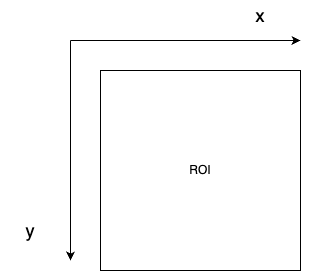
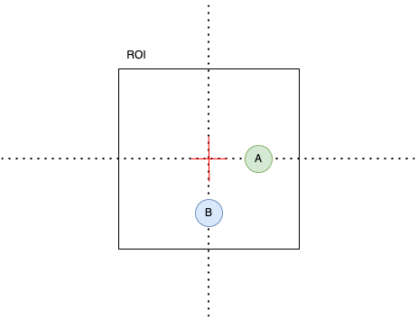
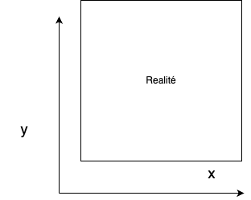

# Projet Imposé - Suivre une couleur

## Introduction 

Rédigé dans le cadre de l'unité "Projet en langage C" du semestre 6 en robotique, ce rapport présente notre méthode, les stratégies adoptées et les solutions techniques développées pour relever un défi stimulant : concevoir un algorithme qui permet à une caméra contrôlée par deux servomoteurs de détecter et suivre une couleur spécifique. L'objectif était de développer un système autonome qui, grâce à la programmation en C et au traitement d'image, maintient la couleur ciblée au centre de son champ de vision, illustrant ainsi notre capacité à créer des applications robotiques interactives.


## Protocole de Communication

L'objectif de ce travail pratique est de contrôler des moteurs Arduino à partir d'un traitement externe au code Arduino, utilisant la communication via le port série.

Dans les systèmes d'exploitation tels que Windows, Linux et Mac, les ports USB sont traités comme des file_inputs virtuels. On peut écrire des données sur ces file_inputs pour communiquer avec un appareil externe. Nous appliquons ce principe en envoyant des commandes de positionnement aux actionneurs via le port série. Le code Arduino est alors chargé de décoder ces informations pour les exécuter de manière adéquate.

En termes de programmation en C/C++, cela se traduit par l'ouverture d'un file_input avec des droits d'écriture, où les coordonnées sont envoyées ligne par ligne pour être décodées par la carte Arduino. Voici l'implémentation :

```cpp
/* Envoie des coordonnées au port série */
void send_coordinates(int x, int y)
{
    FILE *f;

    // Adapter selon le port Arduino utilisé
    f = fopen("/dev/ttyACM5", "w"); // À ajuster en fonction du port de votre Arduino
    if (f == NULL)
    {
        printf("Échec de l'ouverture du file_input\n");
    }
    else
    {
        fprintf(f, "%d %d\n", x, y); // Écrit les données dans le file_input du port série [compatible Linux]
        printf("[%d] Coordonnées X = %d, Y = %d inscrites.\n", time_id, x, y);
        time_id++;
    }

    fclose(f); 
}

```
Cette méthode assure une interaction fluide et efficace entre le système externe et les composants Arduino, permettant un contrôle précis des mouvements des servomoteurs en fonction des coordonnées reçues.

## Algorithme

L'algorithme décrit ci-dessous a été conçu pour réaliser l'objectif souhaité du projet . Voici les étapes: 

1. Capture de la trame : Acquérir une trame en utilisant une Zone d'Intérêt (ROI, pour Region of Interest).
2. Traitement de la trame : Appliquer un traitement et un filtrage à la trame capturée pour isoler la couleur ciblée.
3. Vérification et calcul : Si la couleur ciblée dépasse le seuil de détection prédéfini, procéder au calcul de la position. Si le seuil n'est pas atteint, capturer une nouvelle trame et répéter le processus.
4. Interruption utilisateur : Si une touche est pressée sur le clavier pendant la visualisation en direct (live feed), arrêter le programme.

## ROI (Region of Interest)

Pour simplifier le calcul du centre de l'image contenant la couleur ciblée, nous utilisons la notion de ROI (Region of Interest). Dans notre cas spécifique, nous nous concentrons uniquement sur un carré de 450 x 450 pixels extrait de l'image complète capturée par la caméra.

Dans notre code, la variable `roi_image` représente ce rectangle spécifique de l'image qui est utilisé pour le filtrage et la binarisation subséquente.

## Calcul de la position

Grâce à notre expérience avec le robot Baxter, nous avons appris l'importance de déterminer la distance et la direction entre le point ciblé et le centre de l'image, une mesure que nous qualifions d'erreur.

La question centrale est de savoir comment utiliser cette erreur pour ajuster la position des actionneurs. Pour répondre à cette interrogation, nous avons décomposé le problème en quatre sous-problèmes :

1. **Considération de la position initiale du moteur :** Avant de demander à un moteur de se déplacer, il est crucial de prendre en compte sa position actuelle.
2. **Mapping des coordonnées virtuelles vers les coordonnées réelles :** Transformer les coordonnées obtenues à partir de l'image en coordonnées utilisables dans l'environnement physique.
3. **Adaptation de l'échelle des coordonnées :** Ajuster les coordonnées pour qu'elles correspondent à l'échelle utilisée par les actionneurs du système.
4. **Limitation des valeurs acceptées par les actionneurs :** S'assurer que les valeurs envoyées aux actionneurs restent dans leurs limites opérationnelles pour éviter les erreurs de dépassement.

Cette approche nous permet de préciser comment les données de position sont utilisées pour contrôler de manière efficace et précise les mouvements des actionneurs.

### Prise en compte de la position initiale des moteurs 

Pour gérer correctement les actionneurs, il est essentiel de les initialiser à une valeur par défaut au démarrage du système. Voici un code en C++ montrant l'initialisation des positions des servomoteurs :

```cpp
...

int servo1_position = 90;
int servo2_position = 90;

...

while(true)
{ ... }
```

Cette configuration assure que chaque servo commence à partir d'une position neutre. Ensuite, la position est mise à jour continuellement à l'intérieur d'une boucle infinie qui capture l'image à intervalles réguliers (potentiellement avec un délai, détaillé ultérieurement dans la section sur le "Delay de processing"). L'ajustement des angles des servos en fonction de l'erreur calculée se fait comme suit :

```python
angle_x = angle_x +- erreur_x
angle_y = angle_y +- erreur_y
```

Il est important de choisir correctement le signe de l'opération (+ ou -) en fonction de la direction dans laquelle l'erreur doit corriger la position actuelle des servos.

#### Le plan virtuel

Dans le cadre de notre projet, nous définissons l'orientation des axes dans le plan virtuel où l'axe x s'étend de gauche à droite et l'axe y de haut en bas, comme illustré dans l'image ci-dessous. Cette configuration a été établie suite à une expérience simple que nous avons menée pour confirmer l'orientation des axes.



**L'experience:** Nous avons initié l'expérience en activant la caméra, configurée pour nous afficher les coordonnées du centre de la couleur suivie (pour plus de détails, voir la section sur le filtrage de l'image et le traitement). Au cours de cette expérience, le point situé en haut à gauche de l'image avait pour coordonnées (0,0). En déplaçant l'objet vers la droite, nous avons observé une augmentation de la valeur de x. De manière similaire, en déplaçant l'objet vers le bas, la valeur de 
y augmentait. Cette observation nous a permis de confirmer l'orientation des axes dans notre plan virtuel, où x augmente de gauche à droite et y de haut en bas.

#### Projection d'un point du plan virtuel au plan de la réalité

Considérons l'exemple illustré ci-dessous :



Pour positionner le point A dans la réalité, nous devons déplacer le centre de l'image vers la droite. De manière similaire, pour atteindre le point B, le centre doit être déplacé vers le bas.

Notre robot opère dans un cadre cartésien représenté par l'image suivante :



Pour projeter les coordonnées obtenues sur le plan virtuel dans un cadre 1:1 vers le plan de la réalité, il est nécessaire d'inverser l'axe y. Cette inversion est essentielle pour aligner les mouvements du robot avec les coordonnées détectées dans notre système de suivi.

### Mapping des coordonnées correctes

Nous approchons de la solution, mais un détail important nécessite notre attention. Jusqu'à présent, nous avons envisagé le scénario où l'image théorique est déplacée vers le point souhaité. Cependant, en réalité, les actionneurs fonctionnent de manière inverse : ils déplacent le point souhaité vers le centre de l'image théorique.

En conséquence, nous devons ajuster nos calculs pour refléter cette inversion. Ainsi, l'axe x doit être inversé par rapport à notre modèle théorique, tandis que l'axe y ne nécessite pas d'inversion.

Selon ce principe, les ajustements des angles se font comme suit :

```python
angle_x = angle_x - erreur_x  # Compenser l'erreur en \(x\) en inversant la direction
angle_y = angle_y + erreur_y  # Ajouter l'erreur en \(y\) pour ajuster la position

```

### Ajustement de l'échelle de l'erreur

Lors de l'implémentation de notre logique de contrôle sur le robot, nous avons observé que les déplacements effectués étaient plus importants que nécessaires. Cette surréaction découle de notre utilisation initiale d'une échelle de 1:1, où un pixel équivaut à un degré de rotation, ce qui ne reflète pas fidèlement la réalité. En effet, cette correspondance directe entre les pixels et les degrés de rotation n'est pas précise.

Pour résoudre ce problème, il est essentiel de redimensionner l'amplitude de l'erreur afin qu'elle soit cohérente avec l'échelle réelle des degrés en pratique. 

**La solution consiste à appliquer un asservissement proportionnel à l'erreur, réduisant ainsi son ampleur (en tant que nombre, et non en valeur absolue).**

Pour ce faire, nous introduisons une constante de proportionnalité par laquelle les erreurs sont multipliées, permettant ainsi d'ajuster finement la réponse du système. Les formules ajustées pour les positions en x et y deviennent :

La solution est de faire un asservisement proportionel de l'erreur pour le reduire (comme nombre et pas comme valeur).

Il suffit alors de declarer une constate par laquelle les erreurs vont etre multiplé. Ainsi on obtiens la version suivante des equations de la position en x et y.

```
angle_x = angle_x - erreur_x * a
angle_y = angle_y - erreur_y * a

avec a = 0.01 par exemple.
```

### Limitation des valeurs acceptables pour les moteurs

Nous avons constaté que les moteurs réagissent mal lorsqu'ils sont poussés à leurs extrêmes, comme à 0 ou 270 degrés. Il est également critique de ne jamais leur demander d'atteindre des valeurs au-delà de ces limites physiques.

Pour pallier ce problème, nous avons mis en place un système de limitation virtuelle qui empêche d'atteindre de telles positions. Nous avons choisi de restreindre les mouvements entre 20 et 220 degrés. La logique appliquée est la suivante :

```python
if (position_x > 220)
{
angle_x = 220
}
else if(position_x <20)
{
angle_x = 20
}
else
{
angle_x = position_x
}
```

La même logique est appliquée pour la coordonnée y. Pour optimiser cette gestion en C++, nous utilisons :

```cpp
int servo1_position = std::min(std::max(position_first, 20), 220);
int servo2_position = std::min(std::max(position_second, 20), 220);
```

Dans ce code, `servo1_position` et `servo2_position` correspondent respectivement à `angle_x` et `angle_y`, assurant ainsi que les servomoteurs fonctionnent dans un intervalle sécurisé et efficace.


## La notion de dead_zone

Notre algorithme de traitement d'images est extrêmement sensible et peut détecter même les plus infimes variations, souvent dues à des changements de luminosité, de petits mouvements de la caméra ou des vibrations. Cela peut entraîner des modifications fréquentes et mineures de la position du centre de l'objet coloré suivi, empêchant ainsi le système de se stabiliser.

Pour remédier à cela, nous avons introduit une `dead_zone`. Il s'agit d'une zone tampon autour du centre théorique de l'image. Si le point cible se trouve à l'intérieur de cette zone, aucune correction n'est effectuée par les actionneurs. En dehors de cette zone, les corrections sont appliquées selon la logique décrite précédemment.

Cette `dead_zone` permet au système d'ignorer les variations mineures et aide à maintenir la stabilité opérationnelle en évitant des ajustements excessifs et incessants.


### Implémentation du test de la dead_zone

Voici comment nous avons programmé cette fonctionnalité :
```cpp
...
int dead_min = ROI_SIZE / 2 - SEUIL;
int dead_max = ROI_SIZE / 2 + SEUIL;
...

...{
if (!in_dead_zone(dead_min, dead_max, center))
	{
	...
	}
}
```

### Fonction in_dead_zone

```cpp
/* Retruns true if it's inside the dead_zone  */
bool in_dead_zone(int min, int max, const std::pair<int, int> &center)
{
    if ((center.first <= max && center.first >= min) && (center.second <= max && center.second >= min))
    {
        return true;
    }
    else
    {
        return false;
    }
}
```

## Filtrage de l'image et processing

1. **Conversion de l'image en espace de couleur HSV**

Pour traiter l'image plus efficacement, nous la convertissons d'abord de l'espace de couleur BGR (Bleu-Vert-Rouge) en espace HSV (Hue, Saturation, Value), qui facilite la segmentation des couleurs spécifiques.


```cpp
cv::Mat hsv_image;
cv::cvtColor(inputImage, hsv_image, cv::COLOR_BGR2HSV);
```
La fonction cvtColor convertit l'image d'un espace de couleur à un autre. Dans ce cas, elle convertit l'image d'un espace de couleur BGR (Bleu-Vert-Rouge) à HSV.
    - inputImage est l'image d'entrée
    - hsv_image est l'image résultante convertie en espace de couleur HSV

2. **Définition de la plage de valeurs de teinte pour le rouge**

La couleur rouge s'étend sur deux plages dans l'espace HSV. Le rouge pur est situé à l'extrémité inférieure (0) et à l'extrémité supérieure (180) de l'échelle des teintes, donc les valeurs de teinte de 0 à 10 et de 170 à 180 sont sélectionnées. Les valeurs de saturation sont ajustées par rapport à différents essais pour s'assurer que le filtre detecte bien le rouge que nous voulons.

```cpp
cv::Mat redLowerRange, redUpperRange;
cv::inRange(hsv_image, cv::Scalar(0, 70, 50), cv::Scalar(10, 255, 255), redLowerRange);    // Plage inférieure de rouge
cv::inRange(hsv_image, cv::Scalar(170, 70, 50), cv::Scalar(180, 255, 255), redUpperRange); // Plage supérieure de rouge
```
    Chaque cv::Scalar spécifie les limites de Hue, Saturation, et Value.
inRange crée un masque binaire où les pixels dans les plages spécifiées sont blancs, et les autres sont noirs.


3. **Combinaison des plages de rouge**

Les deux masques binaires représentant les plages de rouge sont combinés pour former une image unique où tous les pixels rouges sont identifiés clairement.

```cpp
cv::addWeighted(redLowerRange, 1.0, redUpperRange, 1.0, 0.0, binaryImage);
```

    - cv::addWeighted fusionne les plages inférieure et supérieure de rouge obtenues précédemment.
    - binaryImage est l'image binaire résultante, où les zones rouges sont blanches et le reste est noir.


## Calcul du centre des pixels colorisés

Pour déterminer le centre des zones colorisées dans une image binarisée, nous suivons les étapes suivantes :

1. **Initialisation des variables** : Trois variables sont initialisées : `pos_X` et `pos_Y` pour stocker les positions cumulatives des pixels colorisés, et `counter` pour compter le nombre de ces pixels.
   
2. **Parcours de l'image** : L'image est analysée ligne par ligne et colonne par colonne. À chaque fois qu'un pixel blanc (valeur de 255 dans l'image binarisée) est détecté, ses coordonnées sont ajoutées aux variables `pos_X` et `pos_Y`, et la variable `counter` est incrémentée.

   ```cpp
   for (int i = 0; i < binary_image.rows; i++) {
       for (int j = 0; j < binary_image.cols; j++) {
           if (binary_image.at<uchar>(i, j) == 255) { // Vérifie si le pixel est blanc
               pos_X += j;
               pos_Y += i;
               counter++;
           }
       }
   }
   ```

3. **Calcul de la position moyenne** : Après avoir parcouru toute l'image, la position moyenne du centre des pixels blancs est calculée en divisant les sommes `pos_X` et `pos_Y` par le nombre de pixels détectés (`counter`).

   ```cpp
   pos_X /= counter; 
   pos_Y /= counter; 
   ```

4. **Gestion des cas où aucun pixel n'est détecté** : Si aucun pixel blanc n'est trouvé (`counter` est égal à zéro), des valeurs spécifiques sont retournées pour signaler l'absence de pixels colorisés.

Cette méthode nous permet de calculer de manière efficace la position moyenne des pixels colorisés, séparant les composantes horizontales et verticales, et offre une indication claire lorsque aucun pixel pertinent n'est détecté.


## Thresholding de l'image binarisée

Le thresholding permet de déterminer si le nombre de pixels détectés dans l'image binarisée justifie une action des actionneurs. Cette étape est essentielle pour prévenir les mouvements inutiles, en s'assurant que l'objet détecté est suffisamment significatif avant de procéder au test de la zone morte (dead zone).

```cpp
...
/* Traitement de l'image */
process_image(roi_image, binary_image);

/* Thresholding */
int num_red_pixels = cv::countNonZero(binary_image);
if (num_red_pixels > MIN_RED_PIXELS)
{
	if (!in_dead_zone(dead_min, dead_max))
	{
		// Actions à entreprendre si hors de la dead zone
	}
}

...
```
Après le traitement de l'image, nous obtenons une image binarisée où les pixels blancs représentent les zones qui passent le filtre de couleur. Cependant, tous les pixels blancs détectés ne sont pas forcément indicatifs de la présence de l'objet de la couleur ciblée. Par exemple, lors de la détection de rouge, la caméra peut parfois confondre des nuances de peau ou d'autres éléments de couleur similaire avec l'objet rouge à suivre.

Pour pallier ce problème, le thresholding compte le nombre de pixels blancs (points "test_passé"). Si ce nombre dépasse un seuil prédéfini, nous considérons qu'il y a suffisamment de preuves pour confirmer la présence de l'objet ciblé. Ce test est effectué avant la vérification de la dead zone et le calcul du centre des zones colorisées, évitant ainsi le suivi de points incorrectement détectés ou insignifiants.


## Perspectives d'amélioration


À mesure que notre projet évolue, plusieurs améliorations notables se dessinent. Cependant, en raison de contraintes de temps, nous avons choisi de concentrer d'abord nos efforts sur le développement du projet libre. Voici néanmoins quelques améliorations que nous envisageons comme étant particulièrement intéressantes :

1. **Sélection dynamique de la couleur à suivre** : Offrir à l'utilisateur la possibilité de sélectionner la couleur à traquer directement depuis l'interface utilisateur en utilisant un clic de souris pour choisir un objet à l'écran.
   
2. **Optimisation du filtrage** : Améliorer le processus de filtrage pour augmenter la précision et la réactivité du système de suivi, en réduisant les fausses détections et en améliorant la fidélité des couleurs suivies.

3. **Communication sans fil** : Développer un protocole de communication sans fil, potentiellement en utilisant la Frequency API d'Arduino, pour traiter les coordonnées de manière plus flexible et intégrée.

Ces améliorations pourraient significativement augmenter la fonctionnalité et l'efficacité de notre système, et seront envisagées pour de futures itérations du projet.

## Copyright

###### Vasileios Filippos Skarleas, Evanthia Virginia Anastasopoulou, Yanis Sadoun | 2023 - 2024 All rights reserved
